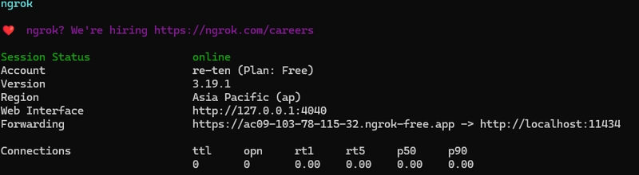
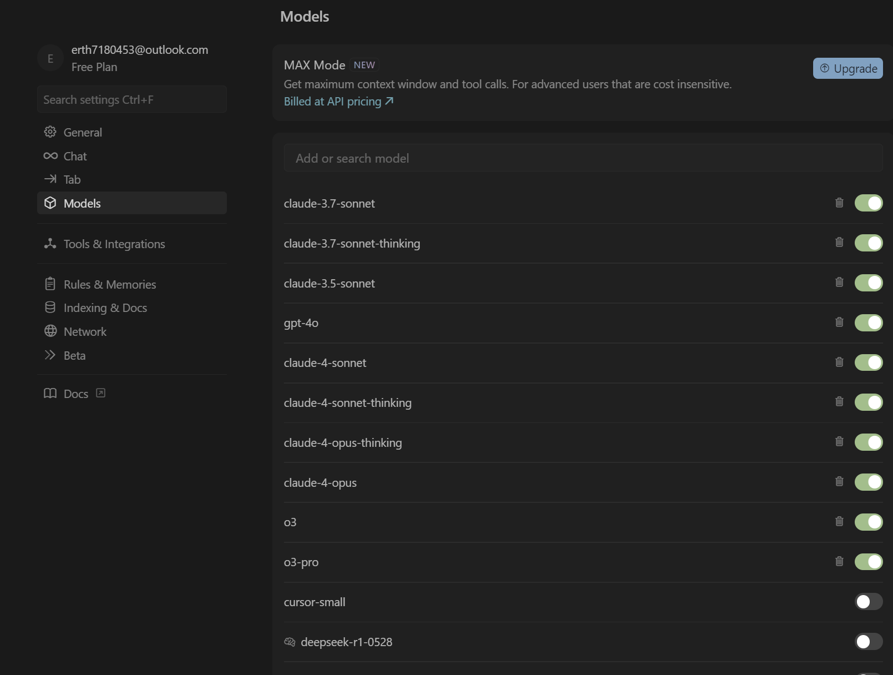
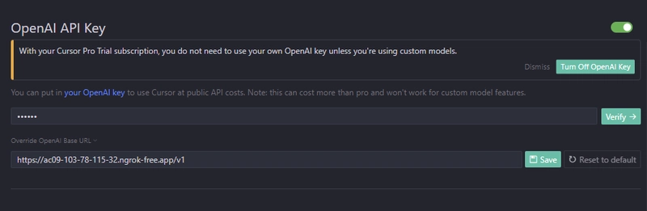
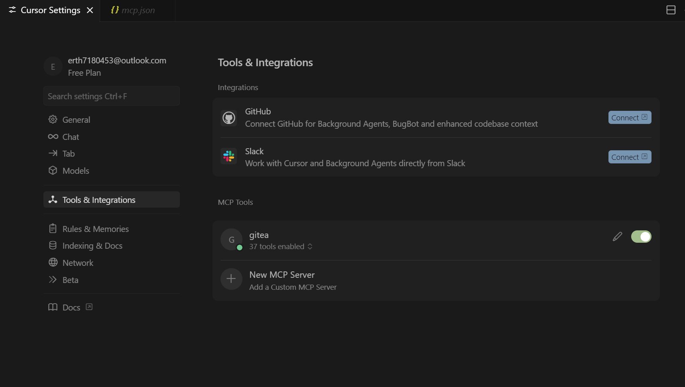
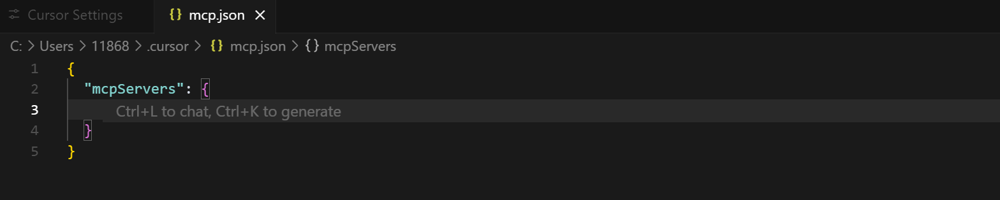
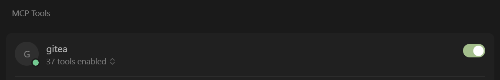

# DevStar MCP Server

DevStar MCP Server 是一个完整的AI驱动开发平台解决方案，通过集成 DevStar 代码托管平台、私有化大语言模型、Gitea MCP 服务器和 Cursor IDE，为开发者提供智能化的代码生成、管理和审查体验。

## 🏗️ 系统架构

```
┌─────────────────┐    ┌─────────────────┐    ┌─────────────────┐    ┌─────────────────┐
│   DevStar       │    │   Private LLM   │    │  Gitea MCP      │    │    Cursor       │
│   Studio        │───▶│   (Ollama)      │───▶│   Server        │───▶│    IDE          │
│                 │    │                 │    │                 │    │                 │
│ • 代码托管      │    │ • DeepSeek-R1   │    │ • MCP协议       │    │ • AI编程助手    │
│ • DevEnv引擎    │    │ • Qwen2.5-Coder │    │ • Git操作       │    │ • 代码生成      │
│ • CI/CD流水线   │    │ • 本地部署      │    │ • 仓库管理      │    │ • 智能对话      │
└─────────────────┘    └─────────────────┘    └─────────────────┘    └─────────────────┘
```

## 🚀 快速部署

### 一、部署 DevStar 代码托管平台

在Ubuntu-20.04下完成安装：

```
wget -c https://devstar.cn/assets/install.sh && chmod +x install.sh && sudo ./install.sh

devstar help
------------------------------------------------------------------------
DevStar usage help:
  help, -h, --help,     Help information
  start                 Start DevStar Studio
      --port=<arg>      Specify the port number (default port is 8080)
      --version=<arg>   Specify the DevStar Studio Image Version (default verson is latest)
  stop                  Stop the running DevStar Studio
  logs                  View the logs of the devstar-studio container
  clean                 Clean up the running DevStar Studio, including deleting user data. Please use with caution.
------------------------------------------------------------------------
sudo devstar start
...
-------------------------------------------------------
DevStar started in http://localhost:8080 successfully!
-------------------------------------------------------
```

然后通过浏览器打开[http://localhost:8080](http://localhost:8080/) 完成后配置安装，默认第一个注册用户为管理员账户。

**产出结果：** 可访问的 DevStar 代码托管平台 URL

如果你想试用在线演示或者使用免费的DevStar服务（有数量限制），请访问 [devstar.cn](https://devstar.cn/)。

如果你想快速本地部署自己的DevStar实例免费试用或者报告问题，请访问 [https://github.com/mengning/DevStar](https://github.com/mengning/DevStar)。

### 二、私有化部署大语言模型

使用 Ollama 在本地部署高性能代码生成模型，并通过 ngrok 提供公共访问接口，支持多种编程语言和开发场景。

**安装部署：**
1. 安装 Ollama
```bash
curl -fsSL https://ollama.com/install.sh | sh
```
2. 下载模型
```bash
ollama pull deepseek-r1:7b      # 平衡选择
ollama pull qwen2.5-coder:7b    # 代码专用
```
3. 启动 Ollama 服务
```bash   
ollama serve
```
4. 安装并配置 ngrok
```bash
curl -sSL https://ngrok-agent.s3.amazonaws.com/ngrok.asc \
  | sudo tee /etc/apt/trusted.gpg.d/ngrok.asc >/dev/null \
  && echo "deb https://ngrok-agent.s3.amazonaws.com bookworm main" \
  | sudo tee /etc/apt/sources.list.d/ngrok.list \
  && sudo apt update \
  && sudo apt install ngrok

ngrok config add-authtoken
```
5. 启动 ngrok 提供公共访问
```bash  
ngrok http 11434 --host-header="localhost:11434"
```

**产出结果：** 通过 ngrok 公共 URL 访问的本地大模型 API




📖 [详细部署指南](docs/deploy-llm.md)

### 三、部署 Gitea MCP 服务器

**安装配置：**
```bash
# 从源码构建
git clone https://gitea.com/gitea/gitea-mcp.git

make install
# 构建后，将二进制文件 gitea-mcp 复制到系统 PATH 中包含的目录。例如：
cp gitea-mcp /usr/local/bin/

```

**产出结果：** 可用的 Gitea MCP 服务器实例

📖 [详细配置指南](docs/devstar-mcp.md)

### 第四步：配置 Cursor IDE

在 Cursor 中集成前面配置好的 MCP 服务器和私有 LLM，实现 AI 驱动的智能编程体验。

#### 4.1 在 Cursor 中配置 LLM

**内置模型**

cursor内置了很多LLMs，包括最先进的GPT4、Claude4和openai最新发布的推理模型o3，在右上角的设置中即可打开相应的模型进行辅助编程。



**私有LLM**

1. 定义我们在cursor中使用的模型，可以使用 `ollama list` 查看您拥有的模型列表。

2. 在 OpenAI Key 字段输入：`ollama`

3. 在 Base URL 字段输入：前面步骤中获取的 ngrok 公共地址
  
4. 点击Verify，如果不成功，取消选中所有其他模型，仅选中刚添加的模型，再点击 Verify 即可。



#### 4.2 在 Cursor 中配置 MCP 服务器

**全局设置**

1. Cursor Setting → Tools & Integrations → MCP Tools
2. 点击 "New MCP Server"
3. 将前面步骤中的 MCP 配置代码添加到 `mcp.json` 文件





**mcp.json文件**

**stdio方式**

将GITEA_HOST配置为前面步骤中获取的 DevStar 代码托管平台 URL

GITEA_ACCESS_TOKEN配置为个人的access token

```
# 配置 MCP 服务器 --stdio
{
  "mcpServers": {
    "gitea": {
      "command": "gitea-mcp",
      "args": [
        "-t",
        "stdio",
        "--host",
        "https://devstar.cn"
        // "--token", "<your personal access token>"
      ],
      "env": {
        // "GITEA_HOST": "https://devstar.cn",
        // "GITEA_INSECURE": "true",
        "GITEA_ACCESS_TOKEN": "<your personal access token>"
      }
    }
  }
}
```


**sse方式**

```
./gitea-mcp -t sse --port 8080 --host <your devstar url> --token <your personal access token>

#配置 MCP 服务器 --sse
{
  "mcpServers": {
    "gitea": {
      "url": "http://localhost:8080/sse"
    }
  }
}
```


#### 4.3 验证配置

1. **检查 MCP 状态：** 在 Settings → MCP 中确认服务器显示为 **Enabled** 且有绿点标识
2. **测试功能：** 使用 `Ctrl + L` 打开智能对话，选择 Agent 模式测试代码生成和仓库操作



📖 [详细配置指南](docs/cursor.md)

## 📖 使用示例

### 常用工具列表

DevStar MCP 服务器提供以下常用工具，帮助您高效管理 Gitea 仓库：

| 工具名称 | 功能分类 | 描述 | 使用示例 |
|---------|---------|------|----------|
| **get_my_user_info** | 🔐 用户管理 | 获取已认证用户信息 | [查看示例](docs/example.md#get_my_user_info) |
| **search_users** | 🔐 用户管理 | 搜索用户 | [查看示例](docs/example.md#search_users) |
| **create_repo** | 📦 仓库管理 | 创建新仓库 | [查看示例](docs/example.md#create_repo) |
| **list_my_repos** | 📦 仓库管理 | 列出用户拥有的仓库 | [查看示例](docs/example.md#list_my_repos) |
| **search_repos** | 📦 仓库管理 | 搜索仓库 | [查看示例](docs/example.md#search_repos) |
| **create_branch** | 🌿 分支管理 | 创建新分支 | [查看示例](docs/example.md#create_branch) |
| **delete_branch** | 🌿 分支管理 | 删除分支 | [查看示例](docs/example.md#delete_branch) |
| **list_branches** | 🌿 分支管理 | 列出仓库分支 | [查看示例](docs/example.md#list_branches) |
| **create_issue** | 🐛 问题管理 | 创建新问题 | [查看示例](docs/example.md#create_issue) |
| **list_repo_issues** | 🐛 问题管理 | 列出仓库问题 | [查看示例](docs/example.md#list_repo_issues) |
| **create_issue_comment** | 🐛 问题管理 | 创建问题评论 | [查看示例](docs/example.md#create_issue_comment) |
| **edit_issue_comment** | 🐛 问题管理 | 编辑问题评论 | [查看示例](docs/example.md#edit_issue_comment) |
| **create_pull_request** | 🔄 拉取请求 | 创建拉取请求 | [查看示例](docs/example.md#create_pull_request) |
| **list_repo_pull_requests** | 🔄 拉取请求 | 列出拉取请求 | [查看示例](docs/example.md#list_repo_pull_requests) |

完整的 [使用示例](docs/workflow.md)

[工具列表](docs/list.md)

## 🔧 高级配置

### AI 代码审查
配置自动化的代码审查流程，提升代码质量：

📖 [代码审查配置指南](docs/codereview.md)

## 📄 许可证

本项目遵循 MIT 许可证。商业使用请联系 contact@mengning.com.cn

## 🔗 相关链接

- [DevStar 主项目](https://github.com/mengning/DevStar)
- [在线演示](https://devstar.cn)
- [Gitea MCP 项目](https://gitea.com/gitea/gitea-mcp)
- [Cursor IDE](https://cursor.sh)

---

**开始您的 AI 驱动开发之旅！** 🚀

