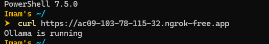
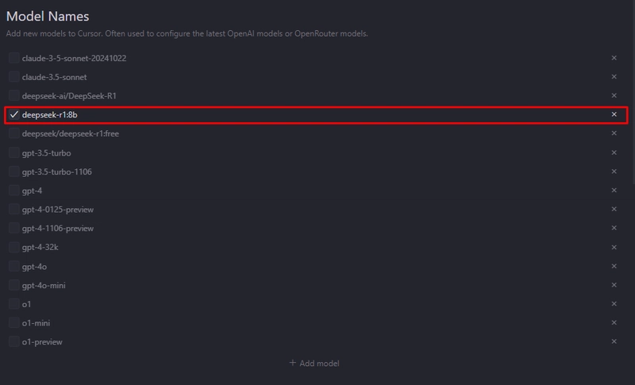
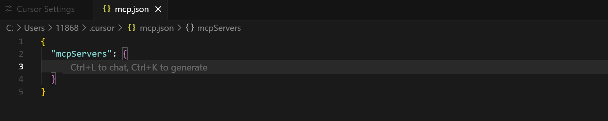

# Cursor 配置

## **内置模型**

cursor内置了很多LLMs，包括最先进的GPT4s、Claude3.5s和openai最新发布的推理模型o1-preview和o1-mini，在右上角的设置中即可打开相应的模型进行辅助编程。


## 私有部署LLM

### 1.安装和配置 ngrok

从[ngrok](https://ngrok.com/)官网下载并登录它，然后他们会指示您通过 Auth Token 登录。

### 2.启动ngrok

我们需要 ngrok 为 ollama 提供公共 URL。

```
.\ngrok.exe http 11434 --host-header="localhost:11434"
```

然后我们得到了 OpenAI Public URL 的端点


检查终端节点是否处于活动状态



### 3.定义模型

定义我们在cursor中使用的模型，可以使用 `ollama list` 查看您拥有的模型列表。



### 4.配置base url 和 openai key

在 OpenAI Key 上，使用 `https://xxxxxx.ngrok-free.app` 的公共 url 和 api key `ollama` 完成。


## MCP

在 Cursor 中添加 MCP Server 有两种配置方式

### 1.1 全局设置

1. Cursor Setting > Tools & Integrations > MCP Tools
2. 点击 “new MCP Server
3. 将代码添加进`mcp.json`


 

### 1.2 项目级别

在项目目录的 `.cursor` 目录中新建 `mcp.json` 文件进行配置，仅对特定项目生效


### 2.1 gitea mcp配置

详见[gitea mcp配置](docs/README.md)


将MCP服务信息填在`mcp.json` 文件中后，需要打开 Settings `->` MCP 检查你配置的 MCP Server 是否在列表中显示，并确认有 **绿点** 且状态为 **Enabled**


### 使用MCP

在Cursor中`Ctrl + L`打开智能对话聊天框，选择Agent模式

