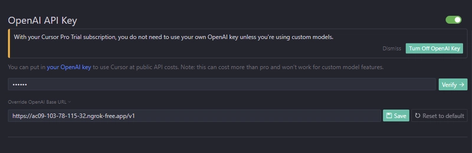

# 本地LLM部署指南

> 本指南将帮助您在本地部署大语言模型(LLM)，并配置continue.dev插件和cursor使用本地模型进行代码开发。

## 安装部署

### 1. 安装 Ollama

#### macOS / Linux

```bash
curl -fsSL https://ollama.com/install.sh | sh
```

#### Windows

从 [Ollama 官网](https://ollama.com/download) 下载安装包并安装。

### 2. 验证安装

```bash
ollama --version
```

### 3.下载模型

1. **DeepSeek-R1**

   ```bash
   ollama pull deepseek-r1:1.5b  # 轻量级
   ollama pull deepseek-r1:7b    # 平衡选择
   ```

2. **Qwen2.5-Coder** 

   ```bash
   ollama pull qwen2.5-coder:1.5b
   ollama pull qwen2.5-coder:7b
   ```

### 4.验证

```
# 列出已下载的模型
ollama list

# 测试模型
ollama run deepseek-r1:1.5b "Hello, can you help me code?"
```

### 5.启动 Ollama 服务

```
# 启动Ollama服务 (默认端口11434)
ollama serve

# 验证服务状态
curl http://localhost:11434/api/tags
```

## 使用 Continue 插件

### 1. 扩展商店安装 "Continue" 插件

### 2. 基础配置

```
{
  "models": [
    {
      "title": "DeepSeek-R1 Local",
      "provider": "ollama",
      "model": "deepseek-r1:1.5b",
      "apiBase": "http://localhost:11434"
    }
  ],
  "tabAutocompleteModel": {
    "title": "Qwen Coder",
    "provider": "ollama",
    "model": "qwen2.5-coder:1.5b",
    "apiBase": "http://localhost:11434"
  },
  "embeddingsProvider": {
    "provider": "ollama",
    "model": "nomic-embed-text",
    "apiBase": "http://localhost:11434"
  }
}
```

## Cursor 配置

### 1.安装和配置 ngrok

从[ngrok](https://ngrok.com/)官网下载并登录它，然后他们会指示您通过 Auth Token 登录。

### 2.启动ngrok

我们需要 ngrok 为 ollama 提供公共 URL。

```
.\ngrok.exe http 11434 --host-header="localhost:11434"
```

然后我们得到了 OpenAI Public URL 的端点


检查终端节点是否处于活动状态


### 3.定义模型

定义我们在cursor中使用的模型，可以使用 `ollama list` 查看您拥有的模型列表。


### 4.配置base url 和 openai key

在 OpenAI Key 上，使用 `https://xxxxxx.ngrok-free.app` 的公共 url 和 api key `ollama` 完成。



