## 可用工具

Gitea MCP 服务器支持以下工具：

|             工具             |   范围   |             描述             |
| :--------------------------: | :------: | :--------------------------: |
|       get_my_user_info       |   用户   |     获取已认证用户的信息     |
|        get_user_orgs         |   用户   |   获取已认证用户关联的组织   |
|         create_repo          |   仓库   |        创建一个新仓库        |
|          fork_repo           |   仓库   |         复刻一个仓库         |
|        list_my_repos         |   仓库   | 列出已认证用户拥有的所有仓库 |
|        create_branch         |   分支   |        创建一个新分支        |
|        delete_branch         |   分支   |         删除一个分支         |
|        list_branches         |   分支   |     列出仓库中的所有分支     |
|        create_release        | 版本发布 |      创建一个新版本发布      |
|        delete_release        | 版本发布 |       删除一个版本发布       |
|         get_release          | 版本发布 |       获取一个版本发布       |
|      get_latest_release      | 版本发布 |      获取最新的版本发布      |
|        list_releases         | 版本发布 |       列出所有版本发布       |
|          create_tag          |   标签   |        创建一个新标签        |
|          delete_tag          |   标签   |         删除一个标签         |
|           get_tag            |   标签   |         获取一个标签         |
|          list_tags           |   标签   |         列出所有标签         |
|      list_repo_commits       |   提交   |     列出仓库中的所有提交     |
|       get_file_content       |   文件   |    获取文件的内容和元数据    |
|       get_dir_content        |   文件   |      获取目录的内容列表      |
|         create_file          |   文件   |        创建一个新文件        |
|         update_file          |   文件   |         更新现有文件         |
|         delete_file          |   文件   |         删除一个文件         |
|      get_issue_by_index      |   问题   |       根据索引获取问题       |
|       list_repo_issues       |   问题   |     列出仓库中的所有问题     |
|         create_issue         |   问题   |        创建一个新问题        |
|     create_issue_comment     |   问题   |       在问题上创建评论       |
|          edit_issue          |   问题   |         编辑一个问题         |
|      edit_issue_comment      |   问题   |       在问题上编辑评论       |
| get_issue_comments_by_index  |   问题   |    根据索引获取问题的评论    |
|  get_pull_request_by_index   | 拉取请求 |     根据索引获取拉取请求     |
|   list_repo_pull_requests    | 拉取请求 |   列出仓库中的所有拉取请求   |
|     create_pull_request      | 拉取请求 |      创建一个新拉取请求      |
|         search_users         |   用户   |           搜索用户           |
|       search_org_teams       |   组织   |       搜索组织中的团队       |
|         search_repos         |   仓库   |           搜索仓库           |
| get_gitea_mcp_server_version |  服务器  | 获取 Gitea MCP 服务器的版本  |

## 使用示例

1.创建一个名为 demo-workflow-repo 的新仓库，描述为“工作流自动化测试仓库”，设置为私有


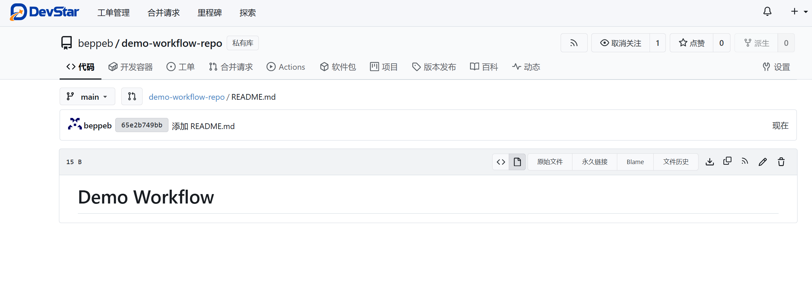

2.在仓库中创建一个功能需求 issue，标题为"实现用户登录功能"，内容为：

```
## 功能需求

需要实现一个基本的用户登录功能，包含以下要点：

1. 创建 login.html 页面，包含用户名和密码输入框
2. 实现 login.js 文件处理表单提交
3. 添加基本的表单验证
4. 实现登录成功后重定向到首页

## 技术要求
- 使用 HTML5 和 CSS3
- JavaScript 原生实现，不依赖框架
- 实现响应式设计

```

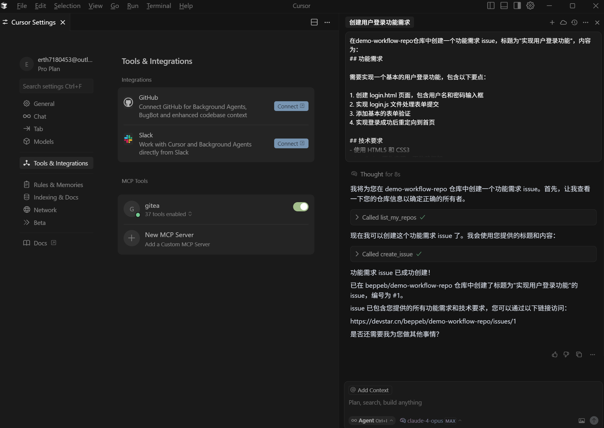

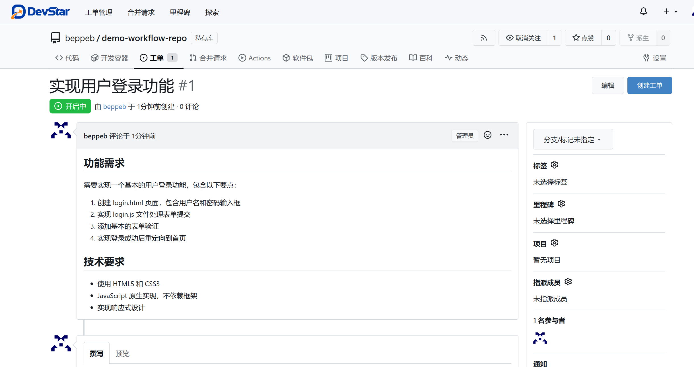

3.列出所有的issue

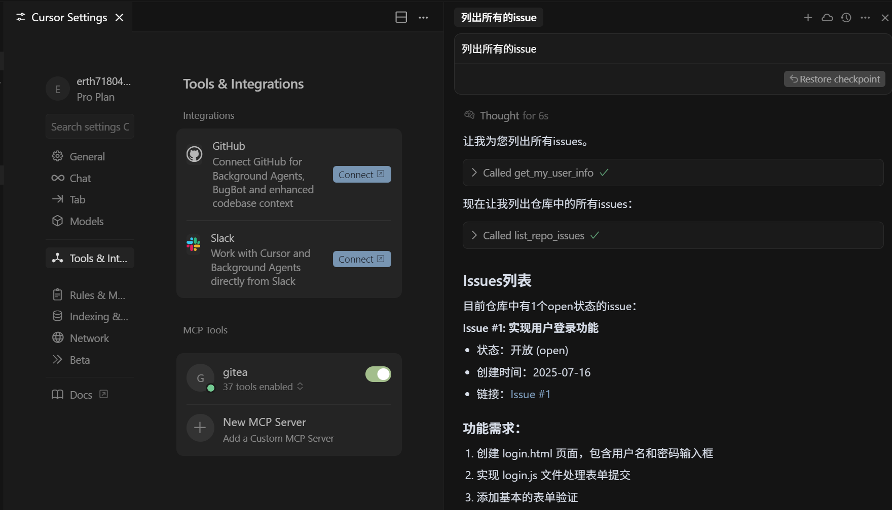

4.基于 issue 需求在本地实现这个功能


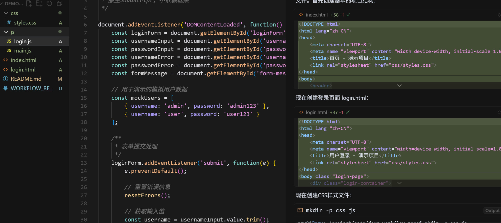

5.提交这个分支

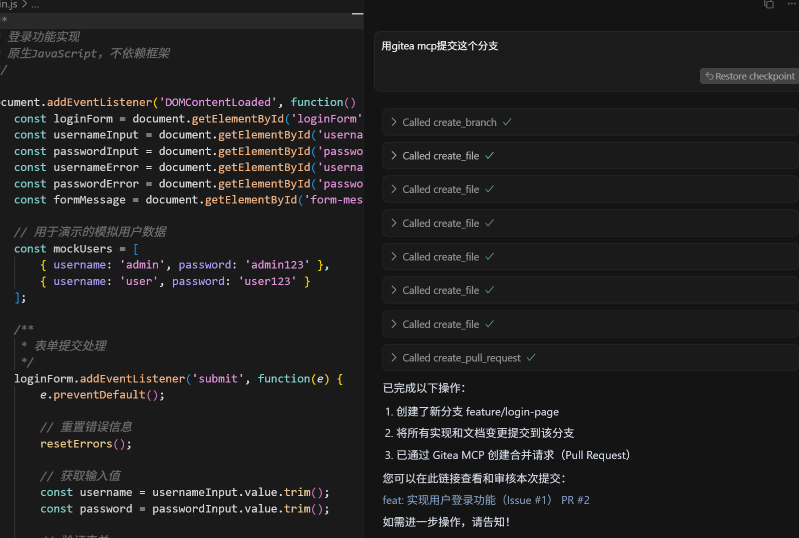

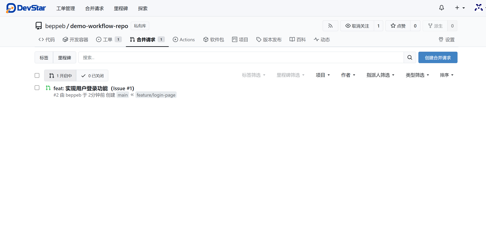

6.给该 PR 添加一条评论："代码已完成，请审核。"

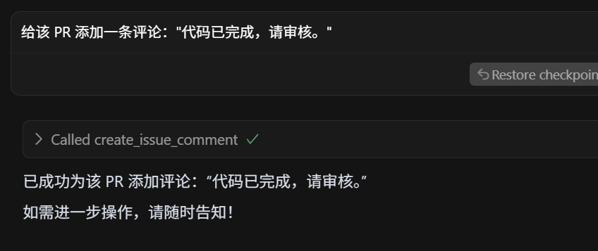

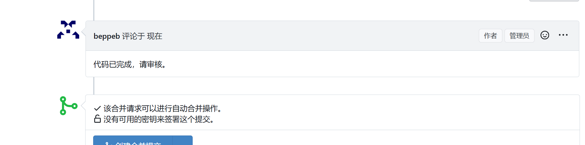

7.关闭该 issue。

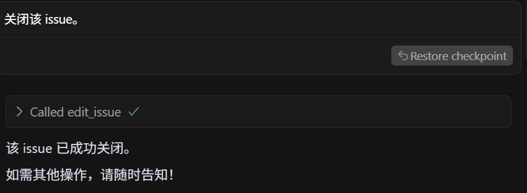

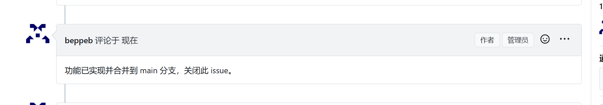


