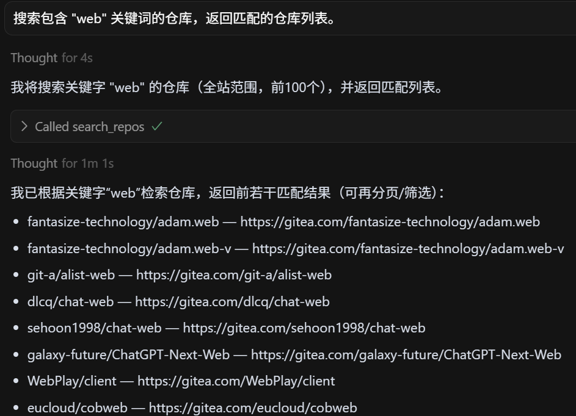

# DevStar MCP 使用示例

本文档提供了 DevStar MCP 服务器各种工具的详细使用示例和 prompt 模板。

## 🔐 用户管理

### get_my_user_info
获取已认证用户信息

**Prompt 示例：**
```
获取我的用户信息。
```


### search_users
搜索用户

**Prompt 示例：**
```
请搜索用户名 "john" 的用户，返回匹配的用户列表。
```

**所需参数：**
- keyword: 搜索关键词（如用户名、昵称、邮箱片段）
 


## 📦 仓库管理

### create_repo
创建新仓库

**Prompt 示例：**
```
请帮我创建一个名为 "my-project" 的新仓库，设置为私有仓库，描述为 "这是一个示例项目"。
```

**所需参数：**
- name: 仓库名称
 


### list_my_repos
列出用户拥有的仓库

**Prompt 示例：**
```
列出我的所有仓库
```

**所需参数：**
- page: 页码（从 1 开始）
- pageSize: 每页返回的仓库数量
 


### search_repos
搜索仓库

**Prompt 示例：**
```
搜索包含 "web" 关键词的仓库，返回匹配的仓库列表。
```

**所需参数：**
- keyword: 搜索关键词（匹配仓库名、描述或主题）
 


## 🌿 分支管理

### create_branch
创建新分支

**Prompt 示例：**
```
从 xxx仓库的 main 分支创建一个名为 "feature/user-auth" 的新分支。
```

**所需参数：**
- owner: 仓库拥有者（用户名或组织名）
- repo: 仓库名称
- branch: 新分支名称
- old_branch: 基础分支名称（从该分支创建新分支）
 


### delete_branch
删除分支

**Prompt 示例：**
```
删除名为 "feature/old-feature" 的分支。
```

**所需参数：**
- owner: 仓库拥有者（用户名或组织名）
- repo: 仓库名称
- branch: 要删除的分支名称
 


### list_branches
列出仓库分支

**Prompt 示例：**
```
请列出 "my-project" 仓库的所有分支。
```

**所需参数：**
- owner: 仓库拥有者（用户名或组织名）
- repo: 仓库名称
 


## 🐛 问题管理

### create_issue
创建新问题

**Prompt 示例：**

```
在xxx仓库中创建一个新的 issue，标题为 "修复登录页面样式问题"，描述为 "登录页面的按钮样式在移动端显示异常，需要调整响应式设计"。
```

**所需参数：**
- owner: 仓库拥有者（用户名或组织名）
- repo: 仓库名称
- title: 问题标题
- body: 问题正文/描述
 


### list_repo_issues
列出仓库问题

**Prompt 示例：**
```
请列出 "my-project" 仓库的所有 open 状态的 issue，按创建时间排序。
```

**所需参数：**
- owner: 仓库拥有者（用户名或组织名）
- repo: 仓库名称
 


### create_issue_comment

创建问题评论

**Prompt 示例：**
```
请在 issue #123 下添加评论："这个问题我已经在本地复现，正在修复中，预计明天完成。"
```

**所需参数：**
- owner: 仓库拥有者（用户名或组织名）
- repo: 仓库名称
- index: Issue 索引号（数字编号）
- body: 评论内容
 


### edit_issue_comment
编辑问题评论

**Prompt 示例：**

```
请将我在 issue #123 下的最新评论修改为："修复已完成，正在测试中。"
```

**所需参数：**
- owner: 仓库拥有者（用户名或组织名）
- repo: 仓库名称
- commentID: 评论的唯一编号（ID）
- body: 新的评论内容
 


## 🔄 拉取请求

### create_pull_request
创建拉取请求

**Prompt 示例：**
```
请创建一个从 "feature/user-auth" 分支到 "main" 分支的 pull request，标题为 "添加用户认证功能"，描述为 "实现了用户登录、注册和权限验证功能"。
```

**所需参数：**
- owner: 仓库拥有者（用户名或组织名）
- repo: 仓库名称
- title: PR 标题
- body: PR 描述/正文
- head: 源分支（可含命名空间，如 user:branch）
- base: 目标分支
 


### list_repo_pull_requests
列出拉取请求

**Prompt 示例：**
```
列出 "my-project" 仓库的所有 open 状态的 pull request。
```

**所需参数：**
- owner: 仓库拥有者（用户名或组织名）
- repo: 仓库名称
 


## 💡 高级使用技巧

### 组合使用多个工具
```
请帮我完成以下任务：
1. 搜索包含 "api" 关键词的仓库
2. 在找到的仓库中创建一个新的 issue 报告文档缺失问题
3. 获取该仓库的 README 文件内容进行分析
```

**Agent模式大模型自动规划**

```
比如：不给他用户信息就让列出所有的issue
他会自动规划调用tools 先调用 get_my_user_info确定用户信息 再调用 list_repo_issues
```

