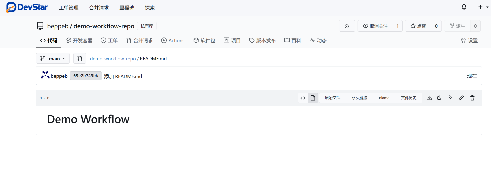
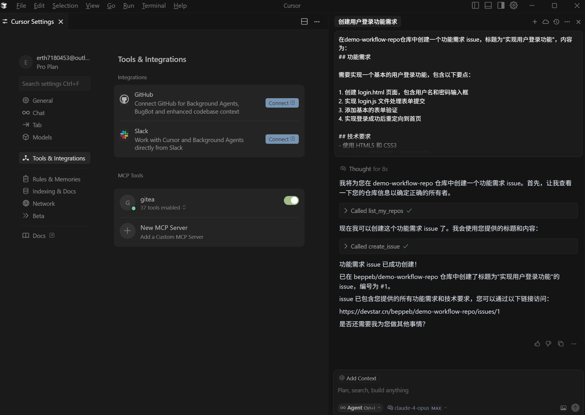
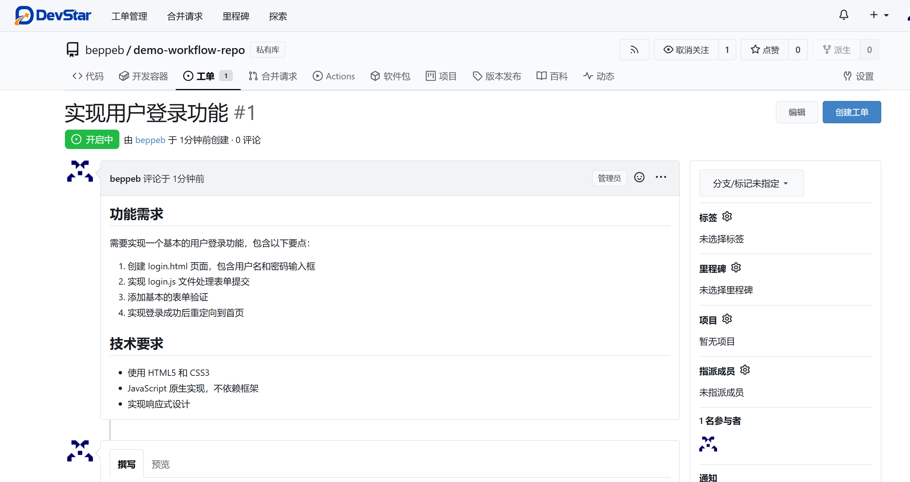
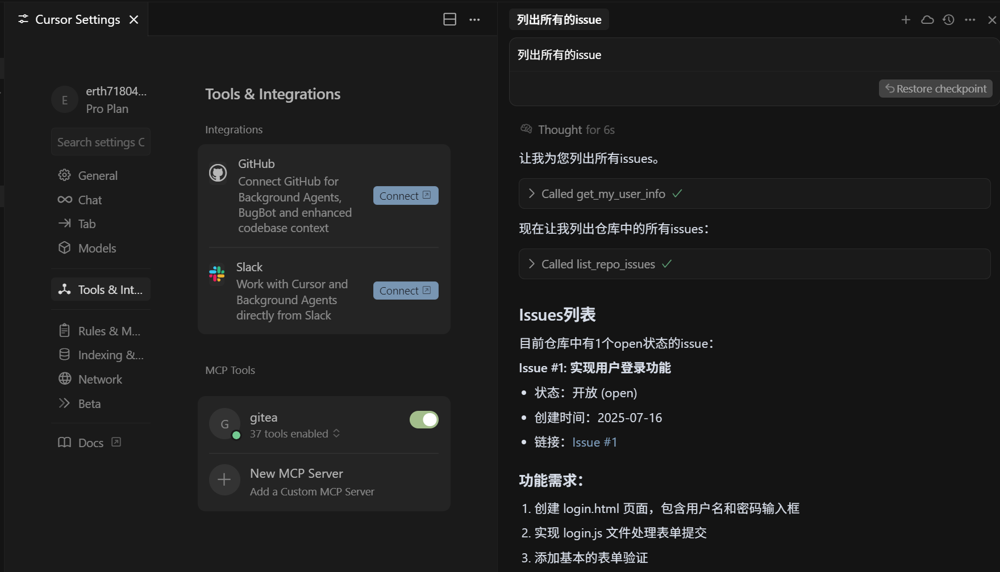
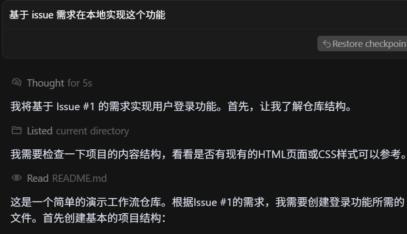
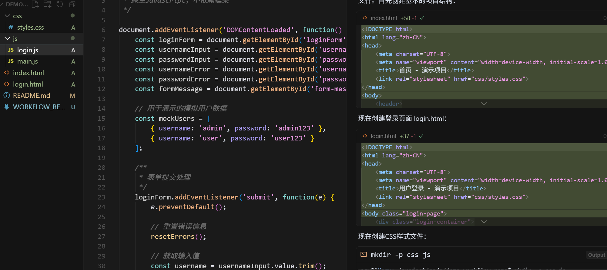
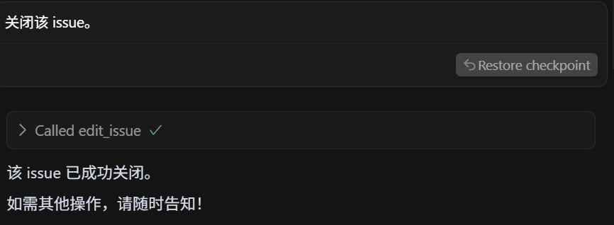

## 使用示例

1.创建一个名为 demo-workflow-repo 的新仓库，描述为“工作流自动化测试仓库”，设置为私有




2.在仓库中创建一个功能需求 issue，标题为"实现用户登录功能"，内容为：

```
## 功能需求

需要实现一个基本的用户登录功能，包含以下要点：

1. 创建 login.html 页面，包含用户名和密码输入框
2. 实现 login.js 文件处理表单提交
3. 添加基本的表单验证
4. 实现登录成功后重定向到首页

## 技术要求
- 使用 HTML5 和 CSS3
- JavaScript 原生实现，不依赖框架
- 实现响应式设计

```





3.列出所有的issue



4.基于 issue 需求在本地实现这个功能





5.提交这个分支


6.给该 PR 添加一条评论："代码已完成，请审核。"


7.关闭该 issue。




